# Operationalizing Machine Learning pipeline in Azure ML

This project is part of the Udacity Azure ML Nanodegree. In this project, we  deployed the best model generated from an auto ml training  process as a realtime web service endpoint.We test the endpoint. We create and publish an azure ml pipeline that reproduce and automate the complete process.

The data is related to direct marketing campaigns (phone calls) of a Portuguese banking institution.The classification goal is to predict if the client will subscribe a term deposit (variable y).

The best performing model was a VotingEnsemble. 

## Architectural Diagram
An architectural diagram of the project:
* Find the best model using Azure auto ML , deploy the model (using Azure Ml Studio portal) and test it (in command line)
* Develop an Azure ML pipeline with all the steps for automation and reproducibility (Organizing and control via a notebook)

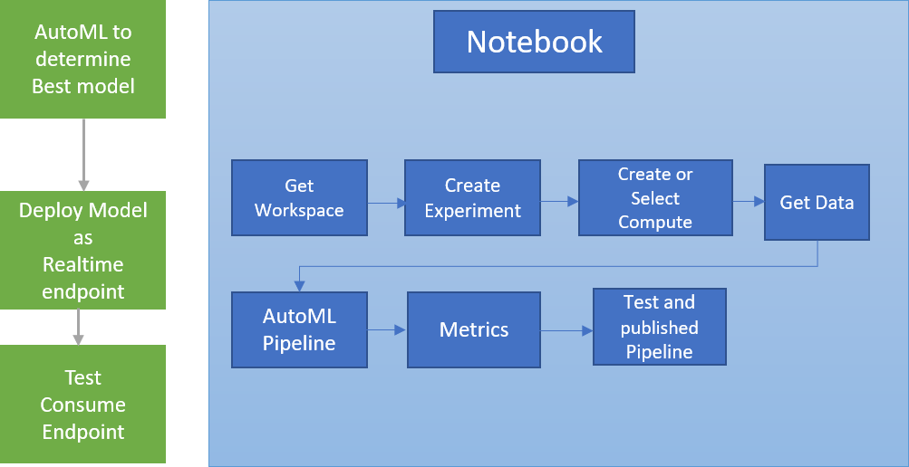

## Key Steps

The key steps for this project were to :
* Create a Service Principal for Azure Ml authentication
* Create and deploy as webservice endpoint the best model from Auto ML to classify direct marketing call from  the BankMarketing dataset.
* Document the endpoint using Swagger
* Create and publish an AutoML pipeline that will allow us to automatically retrain the model

### Screenshots

* Authentication and Auto ML Run
  * Those screens show the creation of a Service Principal for authentication as a first step of Azure Ml deploypment. Also the datasets BankMarketing registered and 
  AutoML run.

    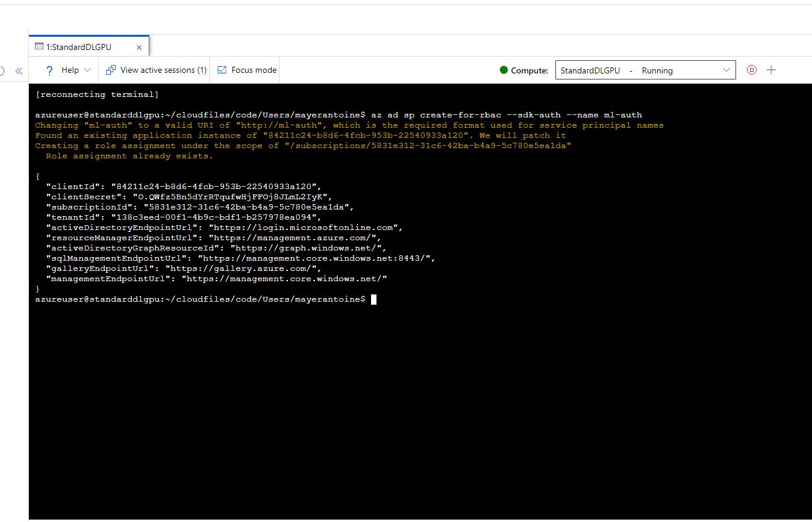
    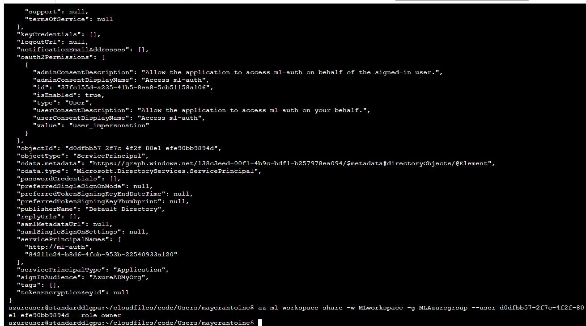
    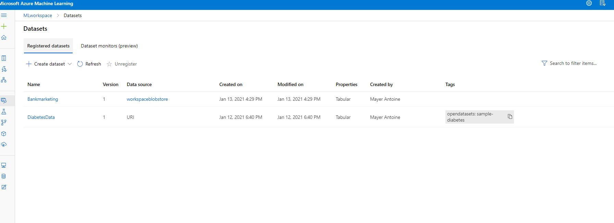
    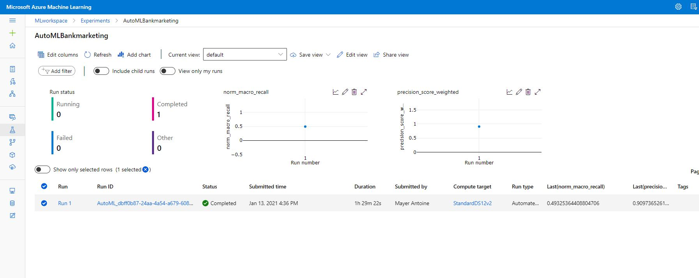

* Best model and application insights logs
  * We can see in these screens the best model selected by using Azure AutoML and application insights logs.

    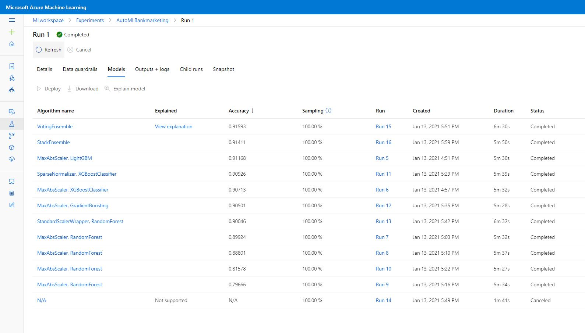
    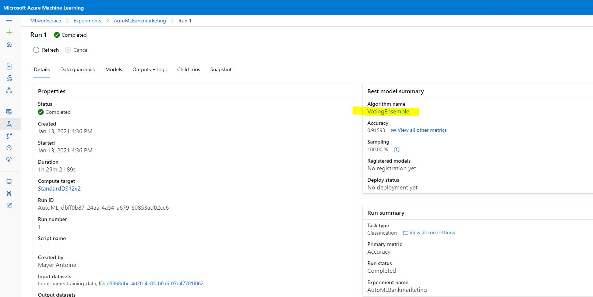
    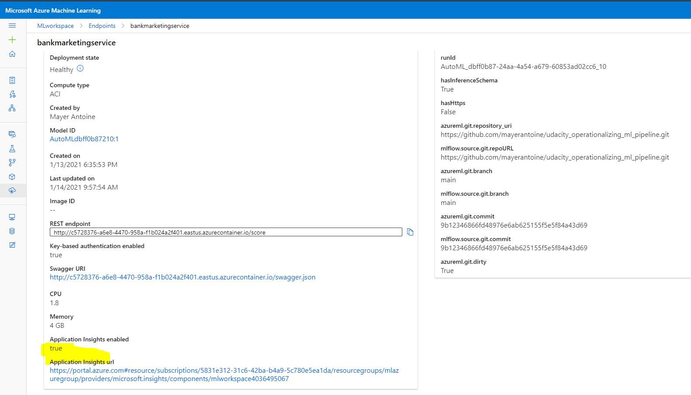
    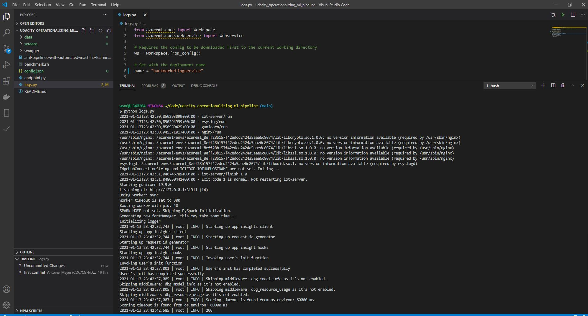

* Swagger and consume endpoint result
  * Swagger is a very good tool that help us document the model  API endpoint deployed.

    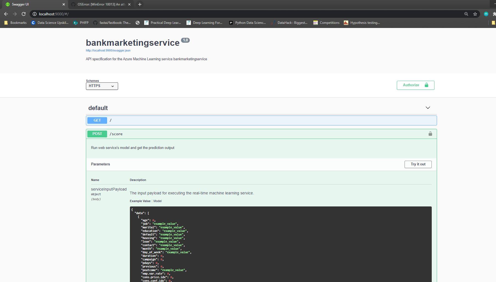
    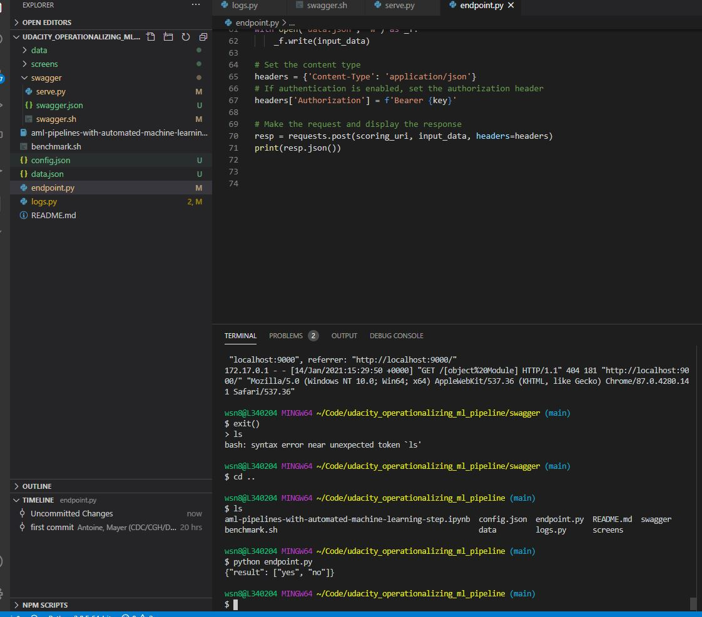

* AutoML Pipeline
    * Here we can see the AutoML pipeline created in jupyter notebook and where it published and ready to retrain the model.

    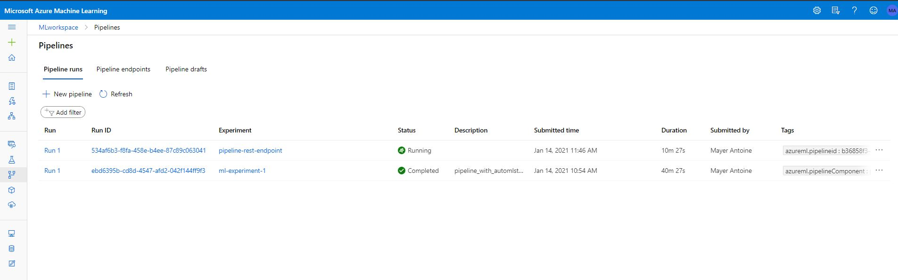
    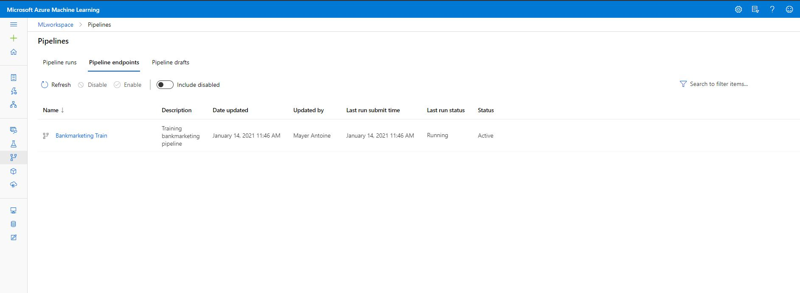
    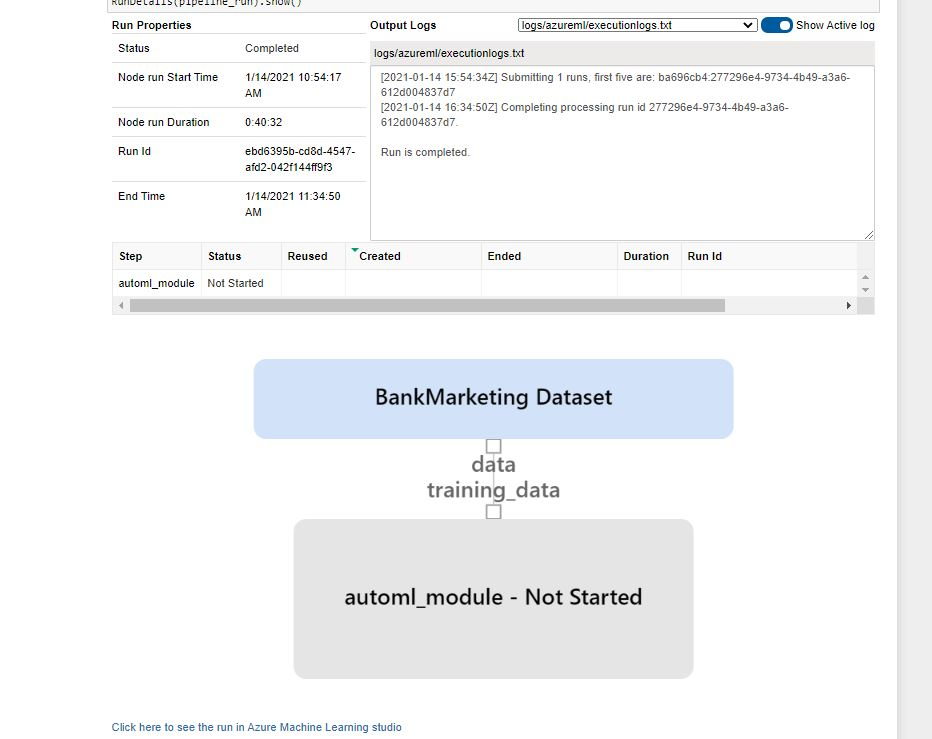
    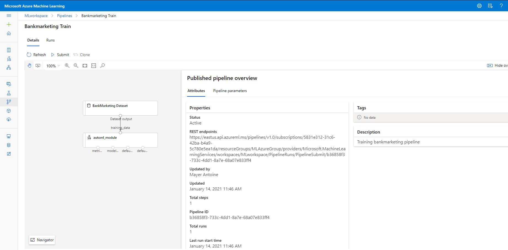

## Screen Recording
[Demo Video](https://youtu.be/jWZosambXSs)

## Future work

Next steps would be to investigate the Voting Ensemble and Hyperparameters to see how we could improve performace. Also the classes were imbalanced, we could also 
look at the impact of oversampling or under-sampling the data on performance in conjunction with other feature engineering techniques using domain knowledge and expertise.
Also we could extend the project into more MLOps by adding source version control to the code and create a DevOps pipeline to kick our ML pipeline when there a valid and tested code commit.